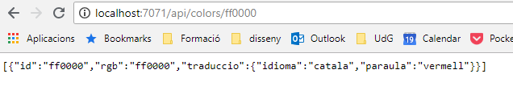

# Serverless ColorsRest

Es tracta d'un servei REST per emmagatzemar les traduccions dels noms dels colors implementat en "Azure Functions". Per tant és un servei sense que s'hagi de configurar cap servidor (serverless) que funciona a través de funcions que s'executen en el moment en que es produeixen algun event (peticions HTTP, arriba un missatge a la cua, quan ha passat cert temps)

O sigui que com en els altres programes que he fet, la idea és emmagatzemar les traduccions dels noms dels colors en diferents idiomes agafant com a clau el codi RGB.

L'estructura és aquesta:

## Què fa?

El programa funciona en Azure Functions i emmagatzema les dades en una 'Cloud Table Storage'

Aquestes dades poden ser recuperades en un navegador amb peticions REST

### Crear un color

S'envia un POST a `/api/colors` amb el contingut

L'estructura per crear una traducció és un document JSON que té aquesta forma:

    {
        "rgb": "0000ff",
        "traduccio": {
            "Idioma": "catala",
            "Paraula": "blau"
        }
    }

### Obtenir els colors

Hi ha diferents URL per obtenir el que hi ha la base de dades

| Mètode | URL                        | Resultat                                                                |
|--------|----------------------------| ------------------------------------------------------------------------|
| GET    | /api/colors                | Retorna tots els colors i traduccions                                   |
| GET    | /api/colors/000000         | Retorna totes les traduccions d'un determinat RGB (en l'exemple 000000) |
| GET    | /api/colors/000000/catala  | Retorna la traducció al català del 000000                               |

### Obtenir les estadístiques per idiomes

Hi ha una referència per obtenir les estadístiques per idiomes. Es crida a la url `/api/stats`.

Retorna un objecte JSON com aquest:

    [
        {
            "idioma": "angles",
            "quantitat": 1
        },
        {
            "idioma": "castella",
            "quantitat": 2
        },
        {
            "idioma": "catala",
            "quantitat": 7
        }
    ]

La gràcia d'aquesta petició és que es genera l'estadística a partir d'una funció que s'executa en el moment en que detecta que hi ha un missatge en una cua de missatges

## Requeriments

### Executar a Azure

 Cal instal·lar el simulador de Functions [Azure Functions Core Tools](https://docs.microsoft.com/en-us/azure/azure-functions/functions-run-local) que permet desenvolupar l'aplicació i executar-la en local

Per penjar l'aplicació a Azure cal:

- Creant un compte a Azure (si no en tens)
  - Creant un grup de recursos
  - Creant un projecte Azure Functions
  - Creant 'Storage'
- Canviant les dades de connexió actuals que es troben a `local.settings.json` per les que tingueu a Azure (les que hi ha són les de desenvolupament)

Tot això es pot fer fent servir la [consola d'Azure](https://docs.microsoft.com/en-us/cli/azure/install-azure-cli?view=azure-cli-latest)

Seria més o menys això. Primer fem login (si no l'hem fet abans):

    az login

Creem el grup de recursos en el que hi haurà tot el que necessita l'aplicació:

    az group create --name grupet --location westeurope

Creem l'espai d'emmagatzematge:

    az storage account create --name magatzem --location westeurope \
                             --resource-group grupet --sku Standard_LRS

Creem l'aplicació:

    az functionapp create --resource-group grupet --consumption-plan-location westeurope \
                          --name aplicaciocolors --storage-account grupet

Li diem que volem fer servir la versió 2 d'Azure Functions (perquè és la única que suporta Net Core)

    az functionapp config appsettings set --name aplicaciocolors \
                    --resource-group grupet \
                    --settings FUNCTIONS_WORKER_RUNTIME=~2

I la despleguem amb el simulador de Functions (segurament es deu poder fer amb az però no ho he trobat)

    func azure functionapp publish aplicaciocolors

### Executar en local

En local s'ha de simular tot el que hi ha a Azure. Per tant cal instal·lar el simulador de Functions [Azure Functions Core Tools](https://docs.microsoft.com/en-us/azure/azure-functions/functions-run-local) i el [emulador de Storage](https://docs.microsoft.com/es-es/azure/storage/common/storage-use-emulator)

> El emulador de Storage només funciona en Windows. Per Linux hi ha un projecte que es diu [Azurite](https://github.com/Azure/Azurite) que funciona més o menys igual però que en la versió actual té algun problema amb les Tables.

Un cop tot estigui instal·lat s'inicia l'emulador (des de consola sol ser senzill):

    AzureStorageEmulator.exe start

o Azurite en Linux

    azurite -l carpetaDades

I s'ha d'iniciar el projecte amb les azure-functions-core-tools

    cd FunctionColorApp
    func host start

En el port local 7071 es podrà accedir al servei.

    curl localhost:7071/api/colors
    []
