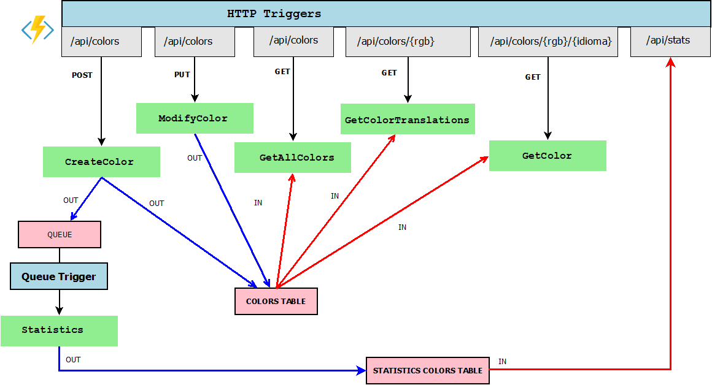

Es tracta d'un servei REST per emmagatzemar les traduccions dels noms dels colors implementat en "Azure Functions"

O sigui que com en els altres programes que he fet, la idea és emmagatzemar les traduccions dels noms dels colors en diferents idiomes agafant com a clau el codi RGB.

L'estructura és aquesta:

Què fa?
------------------------
El programa funciona en Azure Functions i emmagatzema les dades en una 'Cloud Table Storage'

Aquestes dades poden ser recuperades en un navegador amb peticions REST

### Crear un color

S'envia un POST a `/api/colors` amb el contingut

L'estructura per crear una traducció és un document JSON que té aquesta forma:

    {
        "rgb": "0000ff",
        "traduccio": {
            "Idioma": "catala",
            "Paraula": "blau"
        }
    }

### Obtenir els colors

Hi ha diferents URL per obtenir el que hi ha la base de dades

| Mètode | URL                        | Resultat                                                                |
|--------|----------------------------| ------------------------------------------------------------------------|
| GET    | /api/colors                | Retorna tots els colors i traduccions                                   |
| GET    | /api/colors/000000         | Retorna totes les traduccions d'un determinat RGB (en l'exemple 000000) |
| GET    | /api/colors/000000/catala  | Retorna la traducció al català del 000000                               |

### Obtenir les estadístiques per idiomes

Hi ha una referència per obtenir les estadístiques per idiomes. Es crida a la url `/api/stats`.

Retorna un objecte JSON com aquest:

    [
        {
            "idioma": "angles",
            "quantitat": 1
        },
        {
            "idioma": "castella",
            "quantitat": 2
        },
        {
            "idioma": "catala",
            "quantitat": 7
        }
    ]

La gràcia d'aquesta petició és que es genera l'estadística a partir d'una funció que s'executa en el moment en que detecta que hi ha un missatge en una cua de missatges

Requeriments
------------------------
Es pot executar directament al núvol d'Azure: 

- Creant un compte a Azure
    - Creant 'Storage'
-  canviant les dades de connexió actuals que es troben a `local.settings.json` per les que tingueu

O bé en local instal·lant [Azure Functions Core Tools](https://docs.microsoft.com/en-us/azure/azure-functions/functions-run-local) i el [emulador de Storage](https://docs.microsoft.com/es-es/azure/storage/common/storage-use-emulator)

> El emulador només va en Windows. Per Linux hi ha un projecte que es diu [Azurite](https://github.com/Azure/Azurite) que funciona més o menys igual

Llavors s'inicia l'emulador (des de consola sol ser senzill):

    AzureStorageEmulator.exe start

o en Linux

    azurite -l carpetaDades

I s'ha d'iniciar el projecte amb les azure-functions-core-tools

    func host start

